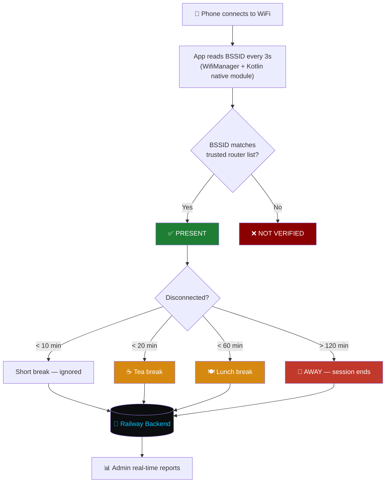

<div align="center">


<a href="https://github.com/vedcr7/Attendance-Monitor-Using-Wifi-App">
  
</a>

<br/>

[](https://reactnative.dev/)
[](https://www.typescriptlang.org/)
[](https://nodejs.org/)
[](https://railway.app/)
[](./LICENSE)


</div>

<br/>

> **A React Native app that fingerprints your office WiFi router (BSSID) to automatically mark employees present, on break, or away — zero manual check-ins.**

<div align="center">

### 🌐 Live Backend

| | |
|---|---|
| **Status** |  |
| **Base URL** | `attendance-monitor-using-wifi-app-production.up.railway.app` |
| **Health Check** | [`/health`](https://attendance-monitor-using-wifi-app-production.up.railway.app/health) |

⚠️ *Running on Railway's free trial — self-host anytime using the guide below.*

</div>

---

## 📋 Table of Contents

<table>
<tr>
<td valign="top" width="33%">

- [🎯 Overview](#-overview)
- [✨ Key Features](#-key-features)
- [⚙️ How It Works](#️-how-it-works)
- [🛠 Tech Stack](#-tech-stack)

</td>
<td valign="top" width="33%">

- [📱 App Flow](#-app-flow)
- [🚀 Getting Started](#-getting-started)
- [📁 Project Structure](#-project-structure)
- [🔌 API Endpoints](#-api-endpoints)

</td>
<td valign="top" width="33%">

- [🔑 Demo Credentials](#-demo-credentials)
- [🌐 Deployment](#-deployment)
- [🗺️ Roadmap](#️-roadmap)
- [🏗️ Permissions](#️-android-permissions-required)

</td>
</tr>
</table>

---

## 🎯 Overview

**WiFi Track** eliminates manual attendance by using the **BSSID (MAC address) of your office router** as a unique identifier. When an employee's phone connects to a trusted router, they're marked **PRESENT** automatically. Disconnecting starts a grace timer — short breaks are tolerated, extended absence gets flagged.

> 💡 **Why BSSID instead of SSID?** Anyone can name a hotspot `Office_WiFi`. A BSSID is the physical access point's hardware MAC address — unique per device and extremely difficult to spoof.

---

## ✨ Key Features

<div align="center">

| | | |
|:---:|:---:|:---:|
| 🔐 **Smart Authentication**<br/>Email/password + Phone OTP | 📡 **Real-time Monitoring**<br/>3s polling — SSID, BSSID, RSSI | 🏢 **Router Verification**<br/>BSSID matched against whitelist |
| ⏱️ **State Machine**<br/>PRESENT → BREAK → AWAY | ☕ **Break Classification**<br/>Short / Tea / Lunch / Extended | 📊 **Attendance Reports**<br/>Session time, breaks, duration |
| 📤 **CSV Export**<br/>Share via email/WhatsApp | 👥 **Employee Management**<br/>Admin CRUD on backend | 📱 **Session Persistence**<br/>Survives app kills |
| 🔄 **Auto-login**<br/>Encrypted JWT storage | 🌐 **Cloud Backend**<br/>REST API, no PC required | 🇮🇳 **Built for Real Offices**<br/>Grace periods, no false flags |

</div>

---

## ⚙️ How It Works



---

## 🛠 Tech Stack

<div align="center">

**Mobile App**


**Backend & Infra**


</div>

<details>
<summary><b>📱 Full mobile app dependency table</b></summary>
<br/>

| Technology | Version | Purpose |
|---|---|---|
| React Native | 0.86.0 | Mobile framework |
| TypeScript | 5.8.3 | Type safety |
| React Navigation | v7 | Screen navigation |
| React Native Paper | v5 | Material UI components |
| Kotlin Native Module | — | Direct WifiManager/ConnectivityManager access |
| AsyncStorage | v3 | Local session persistence |
| EncryptedStorage | v4 | Secure JWT token storage |
| Axios | — | HTTP client for backend API |
| Zustand | v5 | State management |
| React Native Reanimated | v4 | Smooth animations |

</details>

<details>
<summary><b>🖥️ Full backend dependency table</b></summary>
<br/>

| Technology | Purpose |
|---|---|
| Node.js + Express | REST API server |
| JSON file database | Zero-dependency persistent storage |
| bcryptjs | Password hashing |
| jsonwebtoken | JWT authentication |
| CORS | Cross-origin requests from mobile app |

</details>

---

## 📱 App Flow

<div align="center">

| 🔑 Login | 🏠 Dashboard | 📊 Report |
|:---:|:---:|:---:|
| Email + Password<br/>or Phone OTP | ✅ PRESENT · 🏢 VERIFIED<br/>📶 Signal: Good · 🕐 Event Log | 7h 30m connected<br/>☕ 2 breaks (45m) · 📤 Export CSV |

### Status Colors

| Status | Color | Meaning |
|---|:---:|---|
| ✅ PRESENT | 🟢 Green | Connected to trusted router |
| ☕ ON BREAK | 🟠 Orange | Disconnected < 60 min |
| ⚠️ AWAY | 🔴 Red | Disconnected > 120 min |
| 📵 DISCONNECTED | ⚫ Grey | WiFi off or unknown network |

</div>

---

## 🚀 Getting Started

### Prerequisites
- Node.js ≥ 22
- Android Studio + Android SDK
- Java 17
- React Native CLI

### Installation

```bash
# 1. Clone the repository
git clone https://github.com/vedcr7/Attendance-Monitor-Using-Wifi-App.git
cd Attendance-Monitor-Using-Wifi-App

# 2. Install dependencies
npm install
```

### Configure the API URL

Open `src/services/apiClient.ts`:

```ts
// Live Railway backend (works immediately):
export const API_BASE_URL = 'https://attendance-monitor-using-wifi-app-production.up.railway.app';

// Local dev (emulator):
export const API_BASE_URL = 'http://10.0.2.2:3000';

// Local dev (physical device — use your PC's WiFi IP):
export const API_BASE_URL = 'http://192.168.1.X:3000';
```

### Run

```bash
# Start Metro bundler
npx react-native start

# In a new terminal — run on device/emulator
npx react-native run-android
```

### Build a debug APK

```bash
cd android
.\gradlew.bat assembleDebug
```

📦 Output: `android/app/build/outputs/apk/debug/app-debug.apk`

---

## 📁 Project Structure

<details>
<summary><b>Click to expand full directory tree</b></summary>

```
├── android/                          # Android native code
│   └── app/src/main/java/com/wifi_track_attendance/
│       ├── WifiModule.kt             # Kotlin native WiFi bridge
│       └── WifiPackage.kt            # Module registration
│
├── src/
│   ├── components/                   # Reusable UI components
│   │   ├── AttendanceStatusCard.tsx
│   │   ├── RouterVerificationCard.tsx
│   │   ├── ConnectionHealthCard.tsx
│   │   ├── EventLogCard.tsx
│   │   └── SignalMeter.tsx
│   │
│   ├── config/
│   │   ├── attendanceConfig.ts       # Timing constants (grace periods, break limits)
│   │   └── trustedRouters.ts         # Office router BSSID whitelist
│   │
│   ├── hooks/
│   │   ├── useWifiMonitor.ts         # 3s polling + event tracking
│   │   ├── useRouterVerification.ts  # BSSID → trusted list check
│   │   ├── useAttendanceState.ts     # State machine + break timer
│   │   └── useAuth.ts                # JWT session management
│   │
│   ├── screens/
│   │   ├── LoginScreen.tsx
│   │   ├── DashboardScreen.tsx
│   │   ├── AttendanceReportScreen.tsx
│   │   ├── AdminRouterScreen.tsx
│   │   └── EmployeeProfileScreen.tsx
│   │
│   ├── services/
│   │   ├── apiClient.ts              # Axios instance + JWT interceptor
│   │   ├── authService.ts            # Login, OTP, token storage
│   │   ├── attendanceApiService.ts
│   │   └── storageService.ts         # AsyncStorage CRUD
│   │
│   ├── native/
│   │   └── WifiModule.ts             # TypeScript bridge to Kotlin module
│   │
│   └── types/index.ts                # All TypeScript interfaces
│
└── backend/                          # Node.js REST API
    ├── src/
    │   ├── db/
    │   │   ├── database.js           # JSON file database engine
    │   │   └── seed.js               # Demo data seeder
    │   ├── middleware/auth.js        # JWT verification
    │   ├── routes/
    │   │   ├── auth.js
    │   │   ├── employees.js
    │   │   ├── attendance.js
    │   │   └── routers.js
    │   └── server.js
    ├── db.json
    └── package.json
```

</details>

---

## 🔌 API Endpoints

<details open>
<summary><b>🔐 Authentication</b></summary>

| Method | Endpoint | Description |
|:---:|---|---|
| `POST` | `/api/auth/login` | Email + password login |
| `POST` | `/api/auth/request-otp` | Request OTP for phone number |
| `POST` | `/api/auth/verify-otp` | Verify OTP, returns JWT |
| `GET` | `/api/auth/me` | Get current user from token |

</details>

<details>
<summary><b>👥 Employees (Admin only)</b></summary>

| Method | Endpoint | Description |
|:---:|---|---|
| `GET` | `/api/employees` | List all employees |
| `POST` | `/api/employees` | Create employee |
| `PUT` | `/api/employees/:id` | Update employee |
| `DELETE` | `/api/employees/:id` | Deactivate employee |

</details>

<details>
<summary><b>📊 Attendance</b></summary>

| Method | Endpoint | Description |
|:---:|---|---|
| `GET` | `/api/attendance` | Records (admin: all, employee: own) |
| `GET` | `/api/attendance/today` | Today's overview with present/absent |
| `GET` | `/api/attendance/summary` | Stats for date range |
| `POST` | `/api/attendance` | Save/update daily record |

</details>

<details>
<summary><b>📡 Routers</b></summary>

| Method | Endpoint | Description |
|:---:|---|---|
| `GET` | `/api/routers` | List trusted routers |
| `POST` | `/api/routers` | Add router (admin) |
| `PUT` | `/api/routers/:id` | Update router (admin) |
| `DELETE` | `/api/routers/:id` | Remove router (admin) |

</details>

---

## 🔑 Demo Credentials

| Role | Email | Password | Phone (OTP) |
|---|---|---|---|
| 👔 Admin | `admin@company.com` | `Admin@123` | `9000000001` |
| 👤 Employee | `alice@company.com` | `Pass@123` | `9000000002` |
| 👤 Employee | `bob@company.com` | `Pass@123` | `9000000003` |
| 👤 Employee | `carol@company.com` | `Pass@123` | `9000000004` |

> ℹ️ In dev mode, the OTP appears in a yellow box on the login screen — no SMS service needed for testing.

---

## 🌐 Deployment

**Backend is live on Railway:**

```
https://attendance-monitor-using-wifi-app-production.up.railway.app
```

> ⚠️ Hosted on Railway's free trial — live and functional until the trial expires. Upgrade to the hobby plan ($5/mo) or self-host below to keep it running permanently.

<details>
<summary><b>🖥️ Self-host the backend</b></summary>

```bash
cd backend
npm install
node src/server.js
# Server runs on port 3000
```

</details>

<details>
<summary><b>🚂 Deploy your own Railway instance</b></summary>

1. Fork this repository
2. Go to [railway.app](https://railway.app) → New Project → Deploy from GitHub
3. Select your fork → deploy
4. Add environment variable: `JWT_SECRET=your_secret_key`
5. Generate a public domain in Settings → Networking
6. Update `src/services/apiClient.ts` with your new URL
7. Rebuild the APK

</details>

---

## 🗺️ Roadmap

- [ ] Real SMS OTP via Fast2SMS / Twilio
- [ ] Admin live dashboard — real-time status for all employees
- [ ] Multiple office location support
- [ ] Geofencing as secondary verification layer
- [ ] Monthly attendance summary PDF export
- [ ] Push notifications for AWAY status
- [ ] PostgreSQL migration for production scale
- [ ] iOS support

---

## 🏗️ Android Permissions Required

```xml
<uses-permission android:name="android.permission.ACCESS_WIFI_STATE" />
<uses-permission android:name="android.permission.ACCESS_FINE_LOCATION" />
<uses-permission android:name="android.permission.ACCESS_COARSE_LOCATION" />
<uses-permission android:name="android.permission.NEARBY_WIFI_DEVICES" /> <!-- Android 12+ -->
<uses-permission android:name="android.permission.INTERNET" />
```

> 📍 **Why location permission?** Android requires `ACCESS_FINE_LOCATION` to read WiFi SSID/BSSID — an OS-level privacy requirement since Android 8.1. The app does **not** collect or transmit GPS location data.

---

## 📄 License

**© 2026 Vedaansh Gupta — All Rights Reserved**

This software is the **exclusive intellectual property** of Vedaansh Gupta. It is made publicly visible for portfolio and educational purposes only.

**The following are strictly prohibited without prior written permission:**
- Commercial use or deployment in any organization
- Redistribution or resale of source code or compiled binaries
- Creating derivative products based on this codebase

For licensing, collaboration, or commercial inquiries:

📧 **vedaanshgupta0405@gmail.com**
🐙 **[github.com/vedcr7](https://github.com/vedcr7)**

See the full [LICENSE](LICENSE) file for legal terms.

---

<div align="center">

**Built with ❤️ using React Native + Kotlin + Node.js**

*WiFi Track — because attendance should be automatic.*


</div>
