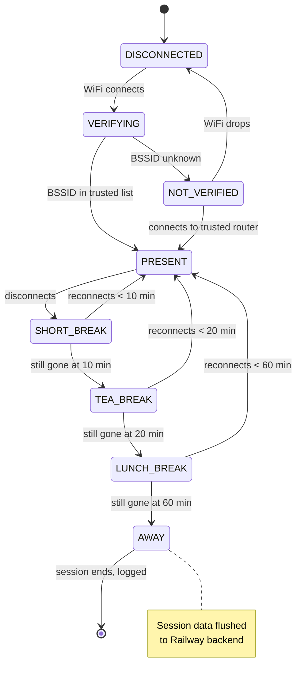
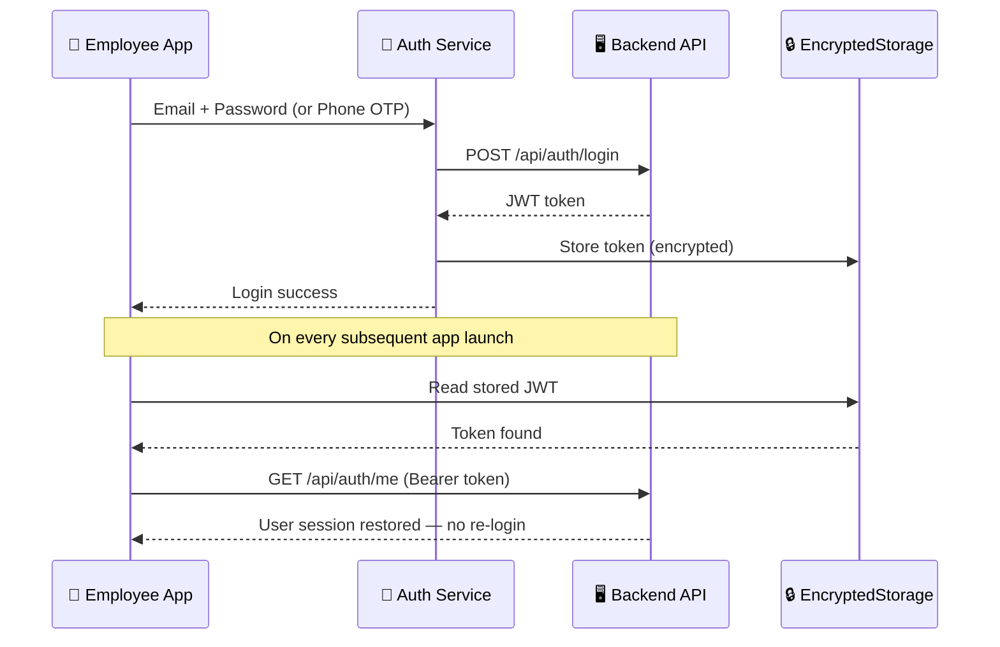
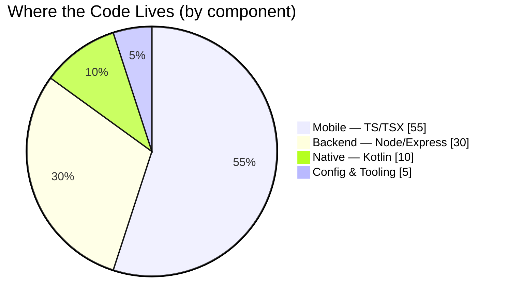
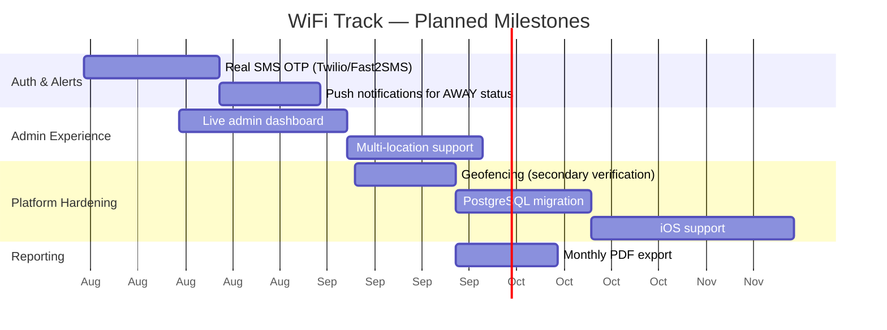

<div align="center">


<br/><br/>

[](https://reactnative.dev/)
[](https://www.typescriptlang.org/)
[](https://nodejs.org/)
[](https://kotlinlang.org/)
[](https://railway.app/)
[](./LICENSE)

<br/>


</div>

<br/>

<div align="center">

<br/>
<sub><i>Live status card — WiFi confirms the router, the ring tracks connected time, the bars pulse with signal.</i></sub>
</div>

<br/>

> **A React Native app that fingerprints your office router (BSSID) to automatically mark employees PRESENT, ON BREAK, or AWAY — no manual check-ins, no spoofable hotspot names, no GPS required.**

<div align="center">

### 🌐 Live Backend

| | |
|---|---|
| **Status** |  |
| **Base URL** | `attendance-monitor-using-wifi-app-production.up.railway.app` |
| **Health Check** | [`/health`](https://attendance-monitor-using-wifi-app-production.up.railway.app/health) |

⚠️ *Running on Railway's free trial — self-host anytime using the guide below.*

<br/>


</div>

---

## 📋 Table of Contents

<table>
<tr>
<td valign="top" width="25%">

**Concept**
- [Overview](#-overview)
- [Why WiFi, Not GPS or Biometrics](#-why-wifi-not-gps-or-biometrics)
- [Key Features](#-key-features)

</td>
<td valign="top" width="25%">

**Architecture**
- [Attendance State Machine](#-attendance-state-machine)
- [Auth Sequence](#-authentication-sequence)
- [Codebase Composition](#-codebase-composition)
- [Tech Stack](#-tech-stack)

</td>
<td valign="top" width="25%">

**Build & Run**
- [Getting Started](#-getting-started)
- [Project Structure](#-project-structure)
- [API Endpoints](#-api-endpoints)

</td>
<td valign="top" width="25%">

**Ops**
- [Security Notes](#-security-notes)
- [Deployment](#-deployment)
- [Roadmap](#️-roadmap)

</td>
</tr>
</table>

---

## 🎯 Overview

Most "smart" attendance systems rely on **GPS geofencing** (easily spoofed by mock-location apps) or **biometric hardware** (expensive, requires physical installation, and still needs someone to walk up and scan). WiFi Track takes a third path: it identifies the **BSSID — the hardware MAC address of the office router itself** — as the trust anchor.

> 💡 **Why BSSID instead of SSID?** Anyone can rename a personal hotspot `Office_WiFi`. A BSSID is burned into the access point's hardware. It can't be renamed, and spoofing it requires cloning a physical device's MAC — a meaningfully higher bar than typing a network name.

When a phone connects to a **trusted** BSSID, the app marks the employee **PRESENT**. Disconnection doesn't instantly flag someone absent — it starts a **grace-period timer**, because someone walking to the printer or stepping out for lunch isn't "away."

---

## ⚖️ Why WiFi, Not GPS or Biometrics

| | GPS Geofencing | Biometric Scanner | 📡 WiFi Track |
|---|:---:|:---:|:---:|
| Spoofable with a free app | ❌ Yes (mock location) | ✅ No | ✅ No |
| Hardware cost | Free | 💰 ₹15k–50k/unit | Free (uses existing router) |
| Works indoors reliably | ❌ Poor (multi-floor buildings) | ✅ Yes | ✅ Yes |
| Requires employee action | ✅ None | ❌ Must walk up & scan | ✅ None (automatic) |
| Tracks precise break duration | ❌ No | ❌ No | ✅ Yes, with auto-classification |
| Setup effort | Low | High (hardware install) | Low (whitelist a BSSID) |

---

## ✨ Key Features

<div align="center">

| | | |
|:---:|:---:|:---:|
| 🔐 **Smart Auth**<br/>Email/password + Phone OTP | 📡 **Real-time Monitoring**<br/>3s polling — SSID, BSSID, RSSI, freq | 🏢 **Router Verification**<br/>BSSID vs. admin-managed whitelist |
| ⏱️ **State Machine**<br/>PRESENT → BREAK → AWAY | ☕ **Break Classification**<br/>Short / Tea / Lunch / Extended | 📊 **Attendance Reports**<br/>Session time, break count, duration |
| 📤 **CSV Export**<br/>Share via email/WhatsApp | 👥 **Employee Management**<br/>Admin CRUD on backend | 📱 **Session Persistence**<br/>Survives app kills |
| 🔄 **Auto-login**<br/>Encrypted JWT storage | 🌐 **Cloud Backend**<br/>REST API, works without a PC running | 🛡️ **Anti-spoof by Design**<br/>Hardware MAC, not a network name |

</div>

---

## 🔄 Attendance State Machine

The actual core logic — a real state machine with timed transitions, not a linear pipeline:



Every transition is timestamped and pushed to the backend, so an admin's report isn't just "present/absent" — it's a full timeline of connect/disconnect events per employee, per day.

---

## 🔐 Authentication Sequence



---

## 🥧 Codebase Composition



<sub><i>Approximate split by component responsibility, not a precise LOC audit.</i></sub>

---

## 🛠 Tech Stack

<div align="center">

**Mobile App**


**Backend & Infra**


</div>

<details>
<summary><b>📱 Full mobile app dependency table</b></summary>
<br/>

| Technology | Version | Purpose |
|---|---|---|
| React Native | 0.86.0 | Mobile framework |
| TypeScript | 5.8.3 | Type safety |
| React Navigation | v7 | Screen navigation |
| React Native Paper | v5 | Material UI components |
| Kotlin Native Module | — | Direct WifiManager/ConnectivityManager access |
| AsyncStorage | v3 | Local session persistence |
| EncryptedStorage | v4 | Secure JWT token storage |
| Axios | — | HTTP client for backend API |
| Zustand | v5 | State management |
| React Native Reanimated | v4 | Smooth animations |

</details>

<details>
<summary><b>🖥️ Full backend dependency table</b></summary>
<br/>

| Technology | Purpose |
|---|---|
| Node.js + Express | REST API server |
| JSON file database | Zero-dependency persistent storage |
| bcryptjs | Password hashing |
| jsonwebtoken | JWT authentication |
| CORS | Cross-origin requests from mobile app |

</details>

---

## 📱 App Flow

<div align="center">

| 🔑 Login | 🏠 Dashboard | 📊 Report |
|:---:|:---:|:---:|
| Email + Password<br/>or Phone OTP | ✅ PRESENT · 🏢 VERIFIED<br/>📶 Signal: Good · 🕐 Event Log | 7h 30m connected<br/>☕ 2 breaks (45m) · 📤 Export CSV |

### Status Colors

| Status | Color | Meaning |
|---|:---:|---|
| ✅ PRESENT | 🟢 Green | Connected to trusted router |
| ☕ ON BREAK | 🟠 Orange | Disconnected < 60 min |
| ⚠️ AWAY | 🔴 Red | Disconnected > 120 min |
| 📵 DISCONNECTED | ⚫ Grey | WiFi off or unknown network |

</div>

---


## 🚀 Getting Started

### Prerequisites
- Node.js ≥ 22
- Android Studio + Android SDK
- Java 17
- React Native CLI

### Installation

```bash
# 1. Clone the repository
git clone https://github.com/vedcr7/Attendance-Monitor-Using-Wifi-App.git
cd Attendance-Monitor-Using-Wifi-App

# 2. Install dependencies
npm install
```

### Configure the API URL

Open `src/services/apiClient.ts`:

```ts
// Live Railway backend (works immediately):
export const API_BASE_URL = 'https://attendance-monitor-using-wifi-app-production.up.railway.app';

// Local dev (emulator):
export const API_BASE_URL = 'http://10.0.2.2:3000';

// Local dev (physical device — use your PC's WiFi IP):
export const API_BASE_URL = 'http://192.168.1.X:3000';
```

### Run

```bash
# Start Metro bundler
npx react-native start

# In a new terminal — run on device/emulator
npx react-native run-android
```

### Build a debug APK

```bash
cd android
.\gradlew.bat assembleDebug
```

📦 Output: `android/app/build/outputs/apk/debug/app-debug.apk`

---

## 📁 Project Structure

<details>
<summary><b>Click to expand full directory tree</b></summary>

```
├── android/                          # Android native code
│   └── app/src/main/java/com/wifi_track_attendance/
│       ├── WifiModule.kt             # Kotlin native WiFi bridge
│       └── WifiPackage.kt            # Module registration
│
├── src/
│   ├── components/                   # Reusable UI components
│   │   ├── AttendanceStatusCard.tsx
│   │   ├── RouterVerificationCard.tsx
│   │   ├── ConnectionHealthCard.tsx
│   │   ├── EventLogCard.tsx
│   │   └── SignalMeter.tsx
│   │
│   ├── config/
│   │   ├── attendanceConfig.ts       # Timing constants (grace periods, break limits)
│   │   └── trustedRouters.ts         # Office router BSSID whitelist
│   │
│   ├── hooks/
│   │   ├── useWifiMonitor.ts         # 3s polling + event tracking
│   │   ├── useRouterVerification.ts  # BSSID → trusted list check
│   │   ├── useAttendanceState.ts     # State machine + break timer
│   │   └── useAuth.ts                # JWT session management
│   │
│   ├── screens/
│   │   ├── LoginScreen.tsx
│   │   ├── DashboardScreen.tsx
│   │   ├── AttendanceReportScreen.tsx
│   │   ├── AdminRouterScreen.tsx
│   │   └── EmployeeProfileScreen.tsx
│   │
│   ├── services/
│   │   ├── apiClient.ts              # Axios instance + JWT interceptor
│   │   ├── authService.ts            # Login, OTP, token storage
│   │   ├── attendanceApiService.ts
│   │   └── storageService.ts         # AsyncStorage CRUD
│   │
│   ├── native/
│   │   └── WifiModule.ts             # TypeScript bridge to Kotlin module
│   │
│   └── types/index.ts                # All TypeScript interfaces
│
└── backend/                          # Node.js REST API
    ├── src/
    │   ├── db/
    │   │   ├── database.js           # JSON file database engine
    │   │   └── seed.js               # Demo data seeder
    │   ├── middleware/auth.js        # JWT verification
    │   ├── routes/
    │   │   ├── auth.js               # Login + OTP endpoints
    │   │   ├── employees.js          # Employee CRUD
    │   │   ├── attendance.js         # Attendance records
    │   │   └── routers.js            # Trusted router management
    │   └── server.js
    ├── db.json                       # Live database file
    └── package.json
```

</details>

---

## 🔌 API Endpoints

<details open>
<summary><b>🔐 Authentication</b></summary>

| Method | Endpoint | Description |
|:---:|---|---|
| `POST` | `/api/auth/login` | Email + password login |
| `POST` | `/api/auth/request-otp` | Request OTP for phone number |
| `POST` | `/api/auth/verify-otp` | Verify OTP, returns JWT |
| `GET` | `/api/auth/me` | Get current user from token |

</details>

<details>
<summary><b>👥 Employees (Admin only)</b></summary>

| Method | Endpoint | Description |
|:---:|---|---|
| `GET` | `/api/employees` | List all employees |
| `POST` | `/api/employees` | Create employee |
| `PUT` | `/api/employees/:id` | Update employee |
| `DELETE` | `/api/employees/:id` | Deactivate employee |

</details>

<details>
<summary><b>📊 Attendance</b></summary>

| Method | Endpoint | Description |
|:---:|---|---|
| `GET` | `/api/attendance` | Records (admin: all, employee: own) |
| `GET` | `/api/attendance/today` | Today's overview with present/absent |
| `GET` | `/api/attendance/summary` | Stats for date range |
| `POST` | `/api/attendance` | Save/update daily record |

</details>

<details>
<summary><b>📡 Routers</b></summary>

| Method | Endpoint | Description |
|:---:|---|---|
| `GET` | `/api/routers` | List trusted routers |
| `POST` | `/api/routers` | Add router (admin) |
| `PUT` | `/api/routers/:id` | Update router (admin) |
| `DELETE` | `/api/routers/:id` | Remove router (admin) |

</details>

---

## 🔑 Demo Credentials

| Role | Email | Password | Phone (OTP) |
|---|---|---|---|
| 👔 Admin | `admin@company.com` | `Admin@123` | `9000000001` |
| 👤 Employee | `alice@company.com` | `Pass@123` | `9000000002` |
| 👤 Employee | `bob@company.com` | `Pass@123` | `9000000003` |
| 👤 Employee | `carol@company.com` | `Pass@123` | `9000000004` |

> ℹ️ In dev mode, the OTP appears in a yellow box on the login screen — no SMS service needed for testing.

---

## 🛡️ Security Notes

<div align="center">

| Concern | How it's handled |
|---|---|
| **BSSID spoofing** | Requires cloning a physical device's hardware MAC — far higher bar than renaming an SSID |
| **Token theft** | JWTs live in `EncryptedStorage` (Android Keystore-backed), not plain AsyncStorage |
| **Password storage** | Hashed with `bcryptjs`, never stored or logged in plaintext |
| **Location permission scope** | Required by Android to read WiFi SSID/BSSID (OS policy since 8.1) — the app does **not** collect or transmit GPS coordinates |
| **API authorization** | All non-auth routes require a valid Bearer JWT, verified server-side per request |

> ⚠️ **Known gap:** the current demo backend uses a JSON file as its database (`db.json`) — fine for a prototype, but the [Roadmap](#️-roadmap) includes a PostgreSQL migration before any real production use.

</div>

---

## 🌐 Deployment

**Backend is live on Railway:**
```
https://attendance-monitor-using-wifi-app-production.up.railway.app
```
> ⚠️ Hosted on Railway's free trial — live and functional until the trial expires. Upgrade to the hobby plan ($5/mo) or self-host below to keep it running permanently.

<details>
<summary><b>🖥️ Self-host the backend</b></summary>

```bash
cd backend
npm install
node src/server.js
# Server runs on port 3000
```

</details>

<details>
<summary><b>🚂 Deploy your own Railway instance</b></summary>

1. Fork this repository
2. Go to [railway.app](https://railway.app) → New Project → Deploy from GitHub
3. Select your fork → deploy
4. Add environment variable: `JWT_SECRET=your_secret_key`
5. Generate a public domain in Settings → Networking
6. Update `src/services/apiClient.ts` with your new URL
7. Rebuild the APK

</details>

---


## 🗺️ Roadmap



<sub><i>Illustrative timeline for planning purposes — not committed dates.</i></sub>

---

## 🏗️ Android Permissions Required

```xml
<uses-permission android:name="android.permission.ACCESS_WIFI_STATE" />
<uses-permission android:name="android.permission.ACCESS_FINE_LOCATION" />
<uses-permission android:name="android.permission.ACCESS_COARSE_LOCATION" />
<uses-permission android:name="android.permission.NEARBY_WIFI_DEVICES" /> <!-- Android 12+ -->
<uses-permission android:name="android.permission.INTERNET" />
```

> 📍 **Why location permission?** Android requires `ACCESS_FINE_LOCATION` to read WiFi SSID/BSSID — an OS-level privacy requirement since Android 8.1. The app does **not** collect or transmit GPS location data.

---

## ❓ FAQ

<details>
<summary><b>What happens if two office locations use the same router brand?</b></summary>
<br/>
BSSIDs are unique per physical hardware unit — no two routers, even the same model bought on the same day, share a MAC address. Whitelisting is per-BSSID, not per-brand.
</details>

<details>
<summary><b>Can an employee fake presence by connecting from home?</b></summary>
<br/>
No — unlike GPS, there's nothing to spoof remotely. The device has to actually associate with the physical access point's radio, which only happens within real WiFi range of the office.
</details>

<details>
<summary><b>Does the app drain battery from constant polling?</b></summary>
<br/>
The 3-second poll only reads already-cached WiFi state via the native Kotlin module — it doesn't trigger new radio scans, so the drain is comparable to leaving WiFi on, not to active scanning.
</details>

---

## 📄 License

(https://github.com/vedcr7/Attendance-Monitor-Using-Wifi-App/blob/main/LICENSE)

<div align="center">

<br/>

**Built with ❤️ using React Native + Kotlin + Node.js**


</div>
